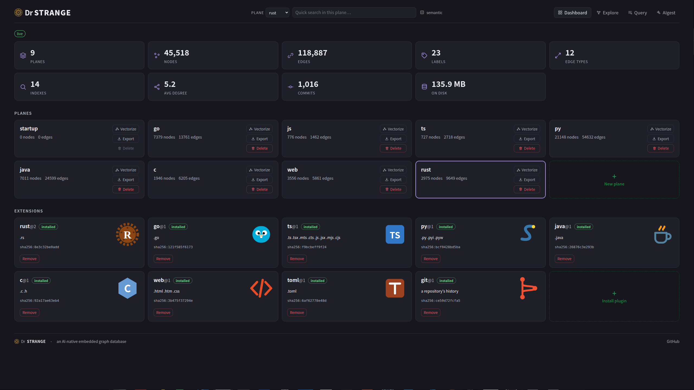
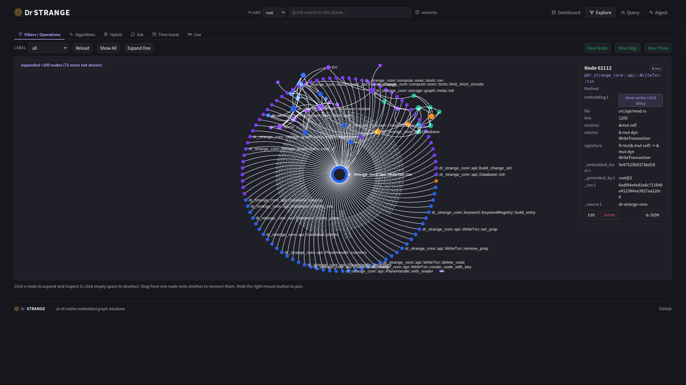
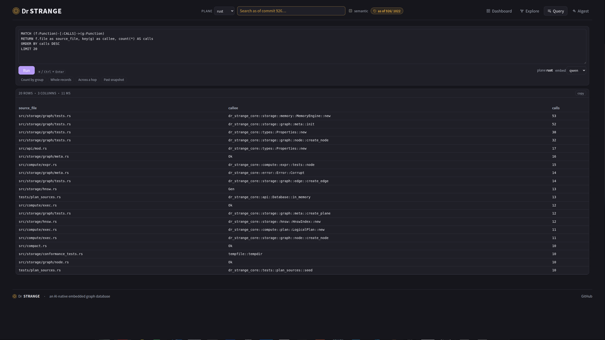
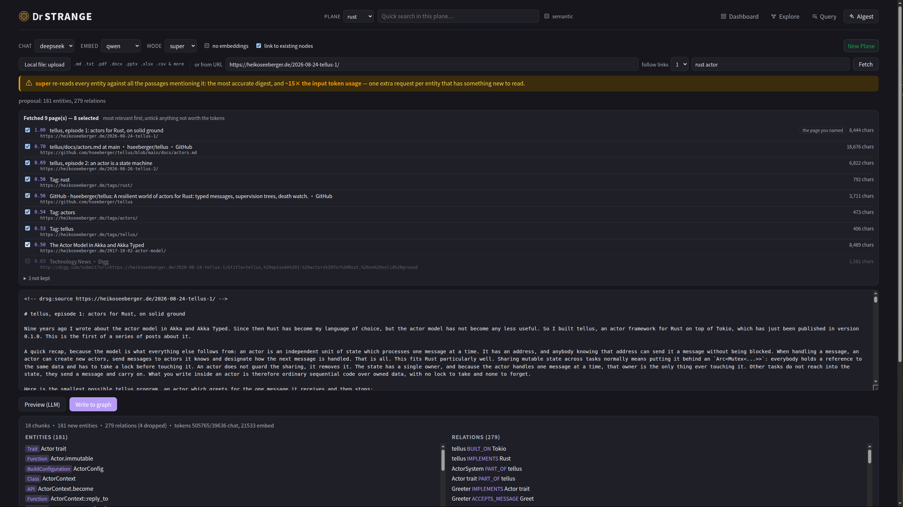
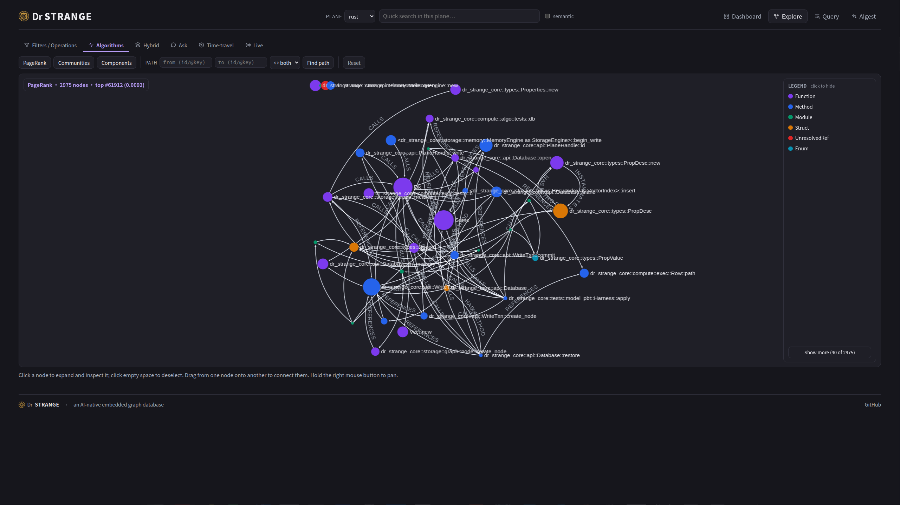
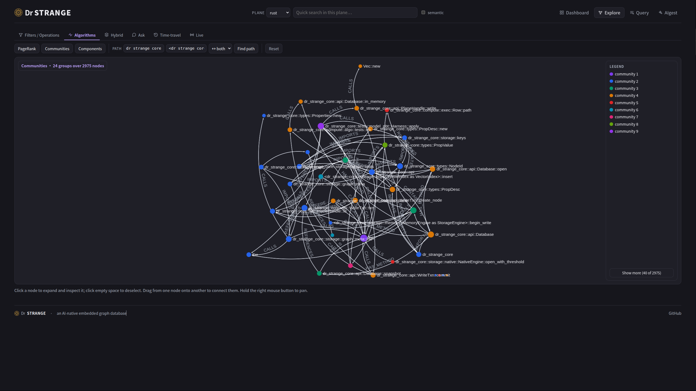
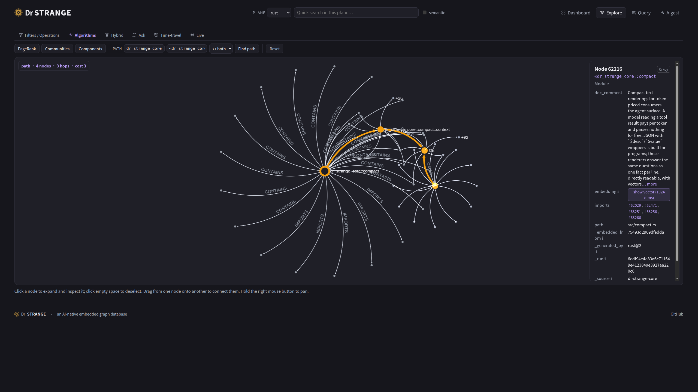
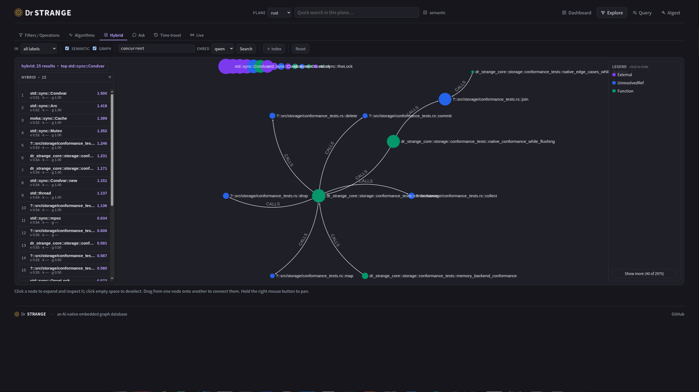
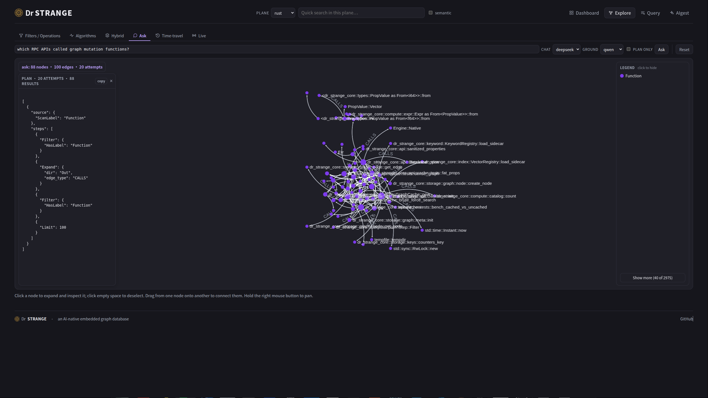
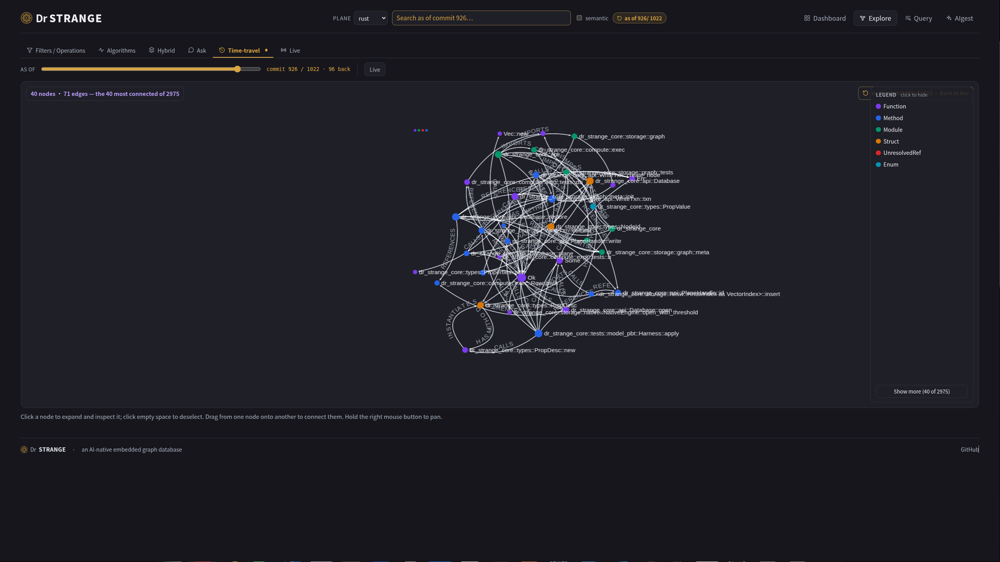

<p align="center">
  
</p>

<h1 align="center">Dr Strange</h1>

<p align="center"><em>An AI-native embedded graph database, written in Rust.</em></p>

<p align="center">
  <a href="https://github.com/wangyingsm/dr-strange/actions/workflows/ci.yml"></a>
  <a href="https://github.com/wangyingsm/dr-strange/actions/workflows/release.yml"></a>
  <a href="https://github.com/wangyingsm/dr-strange/actions/workflows/docs.yml"></a>
  <a href="https://github.com/wangyingsm/dr-strange/releases/latest"></a>
  <a href="LICENSE-MIT"></a>
</p>

<p align="center"><strong>English</strong> · <a href="README.zh.md">简体中文</a></p>

📖 **The Dr Strange Book** — the full tutorial and guide:
[English](https://wangyingsm.github.io/dr-strange/en/book/introduction.html) ·
[中文](https://wangyingsm.github.io/dr-strange/zh/book/introduction.html).

## Introduction

Dr Strange is a graph database designed from the outset for AI workloads:
embeddings are a first-class value type, similarity search operates alongside
graph traversal, and the engine exposes primitives suited to agents — natural
language queries, a live change feed, and time-travel — rather than adding AI
features to a conventional graph database after the fact.

Like SQLite, it is **embedded**: a library linked into an application, backed by a
single on-disk database, with no server to operate. Unlike SQLite, it can also
**serve** — `drsg serve` exposes a JSON-RPC 2.0 API, a browser dashboard, and a
WebSocket change feed, with client SDKs in six languages.

It is also a code-intelligence engine. Sandboxed wasm parser plugins digest a
repository into a graph of symbols and resolved relationships — eight official
languages, no model in the loop. `drsg serve watch` keeps that graph synced to
every commit, and a compact set of agent tools answers structural questions —
who calls this, what breaks if it changes, how does X reach Y — in one round
trip. See [For coding agents](#for-coding-agents).

For applications built around a knowledge graph, a GraphRAG pipeline, or an
agent's long-term memory, Dr Strange aims to be the single store for all of it.

## Web UI screenshots

<table>
  <tr>
    <td width="50%"><a href="screenshots/00.png"></a><br><sub><b>Dashboard</b> — live counts across every plane, plane management, and the installed parser plugins</sub></td>
    <td width="50%"><a href="screenshots/01.png"></a><br><sub><b>Explore</b> — the graph as it stands, with one node open: file, line, signature, and the plugin that asserted it</sub></td>
  </tr>
  <tr>
    <td width="50%"><a href="screenshots/08.png"></a><br><sub><b>Query</b> — a projection comes back as a table — row and column counts, timing, and copy-as-TSV</sub></td>
    <td width="50%"><a href="screenshots/09.png"></a><br><sub><b>AIgest</b> — documents or a crawled URL turned into entities &amp; relations, previewed before anything is written</sub></td>
  </tr>
  <tr>
    <td width="50%"><a href="screenshots/02.png"></a><br><sub><b>PageRank</b> — importance as size and colour, over the whole plane</sub></td>
    <td width="50%"><a href="screenshots/03.png"></a><br><sub><b>Communities</b> — Louvain groups, one colour each</sub></td>
  </tr>
  <tr>
    <td width="50%"><a href="screenshots/04.png"></a><br><sub><b>Shortest path</b> — the route between two symbols, its hops and cost, drawn over the neighbourhood it crosses</sub></td>
    <td width="50%"><a href="screenshots/05.png"></a><br><sub><b>Hybrid</b> — fused vector + keyword + graph-proximity search, each hit showing what every channel contributed</sub></td>
  </tr>
  <tr>
    <td width="50%"><a href="screenshots/06.png"></a><br><sub><b>Ask</b> — a plain-language question turned into a read-only plan, shown and then run</sub></td>
    <td width="50%"><a href="screenshots/07.png"></a><br><sub><b>Time-travel</b> — the same plane as of an earlier commit, on a slider over its history</sub></td>
  </tr>
</table>

## Features

| Capability | What it gives you |
|---|---|
| **Planes** | many independent graphs in one database |
| **First-class embeddings** | vector properties, natively HNSW-indexed |
| **Hybrid retrieval** | fused vector + keyword (BM25) + graph-proximity search |
| **Query language** | a serializable logical plan and an openCypher subset |
| **Graph algorithms** | PageRank, connected components, shortest path, Louvain |
| **Natural-language query** | ask in plain language → plan → run |
| **Time-travel** | read the graph *as of* a past commit or timestamp |
| **Change feed** | subscribe to a plane and receive mutations live |
| **Code digestion** | sandboxed wasm parser plugins turn a repository into a resolved call graph — 8 official languages, an SDK for community parsers |
| **Commit-synced watch** | `serve watch` folds every commit into the plane, convergent with a full re-digest |
| **Agent tools** | `context` · `search` · `describe` · `grep` · `trace` · `impact` · `fathom` · `snippet` — one round trip each |
| **Backup / restore** | consistent, id-faithful whole-database snapshots |
| **Read-only replicas** | `serve --follow` mirrors a running server for read-scaling across a cluster |
| **Interfaces** | a web UI, six language SDKs, a CLI, and an MCP server speaking the agent verbs |

The model-backed features (natural-language query, document ingestion, and
text-embedding search) call an external or local LLM; everything else runs with
no model at all. See [Appendix C](https://wangyingsm.github.io/dr-strange/en/book/appendix-c.html).

## Install

One line, no toolchain. The installer downloads the released binary for your
platform, verifies its SHA-256, and puts it on your `PATH`. Two binaries are
available: the CLI and server, `drsg`, and the MCP server for LLM agents,
`drsg-mcp`.

**Linux**

```console
# CLI and server — drsg
$ curl -fsSL https://raw.githubusercontent.com/wangyingsm/dr-strange/master/scripts/install.sh | sh

# MCP server — drsg-mcp
$ curl -fsSL https://raw.githubusercontent.com/wangyingsm/dr-strange/master/scripts/install.sh | sh -s -- --bin drsg-mcp
```

**macOS** (the same script; Apple silicon and Intel)

```console
# CLI and server — drsg
$ curl -fsSL https://raw.githubusercontent.com/wangyingsm/dr-strange/master/scripts/install.sh | sh

# MCP server — drsg-mcp
$ curl -fsSL https://raw.githubusercontent.com/wangyingsm/dr-strange/master/scripts/install.sh | sh -s -- --bin drsg-mcp
```

**Windows** (PowerShell)

```console
# CLI and server — drsg
PS> irm https://raw.githubusercontent.com/wangyingsm/dr-strange/master/scripts/install.ps1 | iex

# MCP server — drsg-mcp (run as a block: a piped script cannot take arguments)
PS> & ([scriptblock]::Create((irm https://raw.githubusercontent.com/wangyingsm/dr-strange/master/scripts/install.ps1))) -Bin drsg-mcp
```

`--bin all` installs both binaries; `--version v1.1.0` pins a release, and
`--dir <path>` chooses the destination (default `~/.local/bin`, or
`%LOCALAPPDATA%\Programs\drsg\bin` on Windows). On Windows the flags are
`-Bin`, `-Version`, and `-Dir`.

**Staying current.** `drsg update` asks GitHub for the latest release and, if
this build is behind it, hands the process over to the installer above —
pointed at the directory `drsg` is running from, so the copy on your `PATH` is
replaced rather than joined by a second one. A `drsg-mcp` in that directory is
updated with it. A build already current, or newer than the latest release, is
told so and nothing is downloaded.

```console
$ drsg update
drsg 2.4.1 is the latest release — nothing to do
```

Alternatives: the container image, `ghcr.io/wangyingsm/dr-strange:latest`, or the
archives and checksums on the
[releases page](https://github.com/wangyingsm/dr-strange/releases).

**From source** — a last resort, for platforms with no published binary or to
build a working copy. Requires a [Rust toolchain](https://rustup.rs); the
dashboard is embedded at compile time, so build the SPA first (`just web-build`,
which needs [bun](https://bun.sh)) or the binary ships a placeholder page.

```console
$ cargo build --release -p dr-strange-cli   # → target/release/drsg
$ cargo build --release -p dr-strange-mcp   # → target/release/drsg-mcp
```

## Getting Started

```console
# Create a plane, add data, and query it.
$ drsg --db graph.drsg plane create social
$ drsg --db graph.drsg cypher --plane social \
    'CREATE (a:Person {name:"Ada"})-[:KNOWS]->(b:Person {name:"Alan"})'

# Serve the dashboard + API.
$ drsg --db graph.drsg serve
```

The full walkthrough — building, the on-disk layout, embeddings and similarity
search, the server and its configuration, and the container image — is in the
book's **Getting Started** chapter:
[English](https://wangyingsm.github.io/dr-strange/en/book/getting-started.html) ·
[中文](https://wangyingsm.github.io/dr-strange/zh/book/getting-started.html).

## For coding agents

Dr Strange treats a codebase the way it treats any other knowledge: as a
graph. Parser plugins — sandboxed wasm components, one per language — turn
source files into symbols and resolved relationships (CALLS with call sites,
REFERENCES, IMPORTS, EXTENDS, …), with no model in the loop. `serve watch`
then follows the repository commit by commit, so the graph an agent queries
is the code as committed — and each answer opens by saying which commit
(`synced: commit <sha>`).

```console
# Install parser plugins: a name from the official catalog, no argument for
# an interactive chooser over it (0 = all), or any .wasm path or URL.
$ drsg plugin install

# Digest a repository into a plane named after it
$ drsg --db codes.drsg digest ~/src/myrepo --apply --no-embed

# Serve the API + MCP surface and keep the plane synced to every commit
$ drsg --db codes.drsg serve watch --dir ~/src/myrepo

# One symbol's whole neighborhood, one call
$ drsg --db codes.drsg context 'WriteTxn::delete_node' --plane myrepo
```

`--no-embed` skips embeddings — parsing needs no model. Run `drsg vectorize`
later to make the plane semantically searchable.

**`drsg init`** collapses the digest-and-serve steps into one command, run
from the repository itself (plugins still need installing first): it digests
the working directory into a plane named after it, spawns `serve watch`
detached on a freshly-picked address and bearer token, and writes
`.mcp.json` — Claude Code's own convention, also read as-is by GitHub
Copilot. It then writes a matching MCP config for Cursor, OpenCode, Gemini
CLI, or Codex CLI, but only for a tool whose own marker (a directory it
creates, or a config file it already owns) is already present in the
repository.

```console
$ drsg init
plane 'myrepo' bootstrapped — serve watch pid 48213, http://127.0.0.1:51900/mcp
  history → plane 'myrepo_git', current with every commit — `drsg history --plane myrepo`
  + wrote ./.mcp.json
  + Cursor: wrote ./.cursor/mcp.json
```

**Run `drsg init` again whenever the server is gone.** It spawns `serve
watch` detached and records that process's address and bearer token in
`.mcp.json`, but nothing ever restarts it: an MCP `http` entry tells a client
where to connect, not what to launch, so no agent relaunches it and it does
not survive a reboot, a crash, or a kill. Re-running `init` is the way back,
and it is safe at any time — it probes the recorded endpoint first, leaves a
live server alone without opening the database (so it cannot collide with the
running one), and restarts a dead one on the *same* address and token,
skipping the re-parse because the plane resumes from its recorded commit.
Every agent's configuration stays valid across the restart.

```console
$ drsg init                       # already up: nothing to do
drsg is already serving . at http://127.0.0.1:51900/mcp — reusing it, the plane is untouched

$ drsg init                       # after a reboot: same address, same token
plane 'myrepo' restarted — serve watch pid 51002, http://127.0.0.1:51900/mcp
```

Once per repository, then again whenever the server is gone. Pinning `addr`
and `token` under `[server]` in `drsg.toml` keeps the endpoint byte-identical
across restarts even if the recorded port is taken by then.

Eight verbs answer an agent's questions, one round trip each, as compact
one-fact-per-line text. All eight are MCP tools on `drsg serve`; six are
also CLI subcommands (`grep` and `snippet` read the watched source tree, so
they live with the server).

| Verb | The question it answers |
|---|---|
| `context` | everything about one symbol — definition, callers with call sites, callees, references — the primary verb |
| `search` | "I don't know the name": semantic top-k over the plane's embeddings |
| `describe` | one symbol's properties — the lightweight node-only view |
| `grep` | literal text over the watched source tree, bounded and counted |
| `trace` | how one symbol reaches another: the shortest recorded call path |
| `impact` | blast radius: everything reaching a symbol, grouped by distance |
| `fathom` | what kind of place a symbol sits in: the region within a few hops, by label and edge type, with its hubs |
| `snippet` | one symbol's source text |
| `history` | the repository behind the code: HEAD, branches, tags, rebases and the newest commits |

Two disciplines run through every tool. An ambiguous name is never
guessed at: the reply is a list of candidates to pick from. And a call
listing is a stated lower bound: what the parser could not resolve is kept
as `UnresolvedRef` facts with reasons, and the answer says so — a wrong edge
is worse than a missing one.

**History, too.** Digesting a directory that is a git checkout also reads the
repository's **history** into a plane of its own, `<plane>_git`: commits,
branches, tags, merges (`order = 1` is the line a commit was made on), and
the rebases only the reflog remembers — what each replayed, and the tips it
rewrote away. Facts only, never a model call, and no `git` binary is run: the
`git` plugin reads the object store itself, inside the sandbox. Two planes
because they answer different questions and have different lifetimes — the
code plane is the tree *now*, history only grows — and a second digest of an
unchanged repository writes nothing at all. `serve watch` keeps it current
commit by commit, so `drsg init` bootstraps both planes; `drsg history` (and
the MCP tool of the same name) reads one back:

```console
$ drsg history --plane myrepo
429 commit(s), 11 of them merges; 7 branch(es), 15 tag(s), 2 rebase(s)
branches (7 shown of 7):
  * master         5cb5d79  chore(release): bump version to 2.1.1
    origin/master  5cb5d79  chore(release): bump version to 2.1.1
rebases (2):
    master  2026-08-11  onto 7bf6b9a, 3 commit(s), replaced 1c0b734
commits (newest 15 of 429):
  5cb5d79  2026-08-25  crabis  chore(release): bump version to 2.1.1
  …
```

`--no-git` turns the whole stage off, on `digest` and on `serve watch` alike.

**Plugins.** `drsg plugin install` installs any parser plugin — an official
plugin's name, a local `.wasm` file, or a URL — validating it as a component
and pinning its SHA-256, re-checked at every load. The official catalog covers
eight languages (Rust, Go, TypeScript/JavaScript, Python, Java, C, web
(HTML/CSS), TOML) plus `git` for a repository's history, and lives as
`catalog.json` in the
[dr-strange-extension](https://github.com/wangyingsm/dr-strange-extension)
repository rather than compiled into this binary — so a plugin release needs
no drsg release. Each entry pins the artifact's hash, checked on download, and
says which hosts it is for; one this build cannot run is listed with the
reason rather than hidden. `drsg plugin list --available` prints the catalog
tagged against what is installed. The same repository carries the plugin SDKs:
the parser contract is an open WIT interface, and a community parser built
against it installs and runs in the same sandbox as an official one.

**How it compares.** In agent-task benchmarks against a ripgrep-driven
workflow and two open-source code-graph MCP tools, drsg completed every task
shape — callers, impact, flow, and a compound audit — in 2–4 tool calls at
the lowest marginal token cost, and was the only tool whose answers state
their own bounds. Methodology, ledgers, and the full tables:
[AGENT-BENCHMARKS.md](AGENT-BENCHMARKS.md). Design notes:
[arch/07-llm.md](arch/07-llm.md) (digestion, plugins, watch) and
[arch/06-mcp.md](arch/06-mcp.md) (the MCP surface).

## Documentation

The book covers each part in depth:
[AI Native](https://wangyingsm.github.io/dr-strange/en/book/ai-native.html) ·
[Query Language](https://wangyingsm.github.io/dr-strange/en/book/query-language.html) ·
[Web UI](https://wangyingsm.github.io/dr-strange/en/book/web-ui.html) ·
[SDK](https://wangyingsm.github.io/dr-strange/en/book/sdk.html) ·
[Embedded CLI](https://wangyingsm.github.io/dr-strange/en/book/embedded-cli.html) ·
[MCP](https://wangyingsm.github.io/dr-strange/en/book/mcp.html) ·
[Plugins](https://wangyingsm.github.io/dr-strange/en/book/plugins.html) ·
[Coding Agent](https://wangyingsm.github.io/dr-strange/en/book/coding-agent.html) ·
[JSON-RPC API list](https://wangyingsm.github.io/dr-strange/en/book/appendix-a.html) ·
[Query-language grammar](https://wangyingsm.github.io/dr-strange/en/book/appendix-b.html).

Build it locally (mdBook): `just docs-serve` (English) or `just docs-serve zh`.

## Architecture

Dr Strange is built in distinct layers — storage (a hand-rolled LSM engine with
MVCC), a version-stamped cache, computation, the API surface, and the
cross-cutting plane model — with the wrapper layers (web, SDKs, CLI, MCP, LLM)
above the core.

- **[Architecture chapter](https://wangyingsm.github.io/dr-strange/en/book/architecture.html)** — the layer map and how
  the commit sequence unifies MVCC, caching, time-travel, and the change feed.
- **[`arch/`](arch/)** — the detailed, per-layer design notes:
  [overview](arch/00-overview.md),
  [storage](arch/01-storage.md),
  [cache](arch/02-cache.md),
  [computation](arch/03-computation.md),
  [API](arch/04-api.md),
  [tools](arch/05-tools.md),
  [MCP](arch/06-mcp.md),
  [LLM & code digestion](arch/07-llm.md),
  [web UI](arch/08-web-ui.md),
  [planes](arch/09-planes.md).

## Benchmarks

A cross-engine comparison against an embedded graph DB (Kùzu), the universal
embedded baseline (SQLite), and the industry-standard server (Neo4j). Every
engine loads the **same** deterministic dataset — 100 K nodes, 500 K edges,
128-dim vectors — and runs the **same** query sets on its own optimal path.

| Operation (median latency, ↓ better) | dr-strange | Kùzu | SQLite | Neo4j |
|---|---|---|---|---|
| Point lookup by key | **3.3 µs** | 256.0 µs | 3.4 µs | 286.6 µs |
| 1-hop expansion | **6.2 µs** | 1.64 ms | 8.2 µs | 328.0 µs |
| 2-hop reachable set | **26.8 µs** | 6.72 ms | 64.8 µs | 842.9 µs |
| Vector top-k query | **290.0 µs** | 7.43 ms | — | 2.43 ms |

The embedded KV design keeps every graph query in single-digit-to-tens of
microseconds — point lookup effectively tied with SQLite, expansion and
multi-hop traversal fastest of the field — and vector search is where it pulls
away: top-k ~8× below Neo4j and ~26× below Kùzu, with index build several
times faster than both (full table in BENCHMARKS.md). Bulk load still trails the mature columnar
engines. Every figure is the median of three measurement passes, all engines
pinned to the same cores on one machine — **indicative, not a leaderboard**.
Methodology, caveats, per-op spreads, the load-throughput figures, and how to
re-run (`just bench-compare`, or `just benchmark` for dr-strange alone) are in
**[BENCHMARKS.md](BENCHMARKS.md)**.

## License

Licensed under either of

- Apache License, Version 2.0 ([LICENSE-APACHE](LICENSE-APACHE) or
  <http://www.apache.org/licenses/LICENSE-2.0>)
- MIT license ([LICENSE-MIT](LICENSE-MIT) or
  <http://opensource.org/licenses/MIT>)

at your option.

### Contribution

Unless you explicitly state otherwise, any contribution intentionally submitted
for inclusion in the work by you, as defined in the Apache-2.0 license, shall be
dual licensed as above, without any additional terms or conditions.
