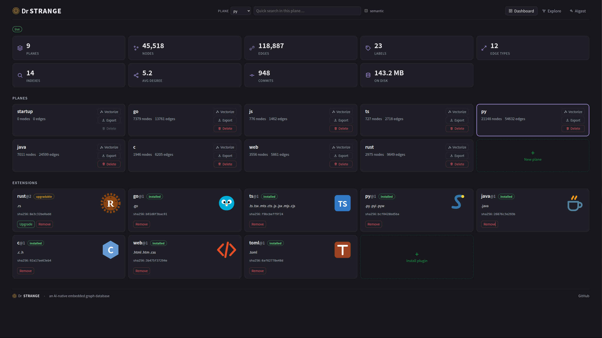
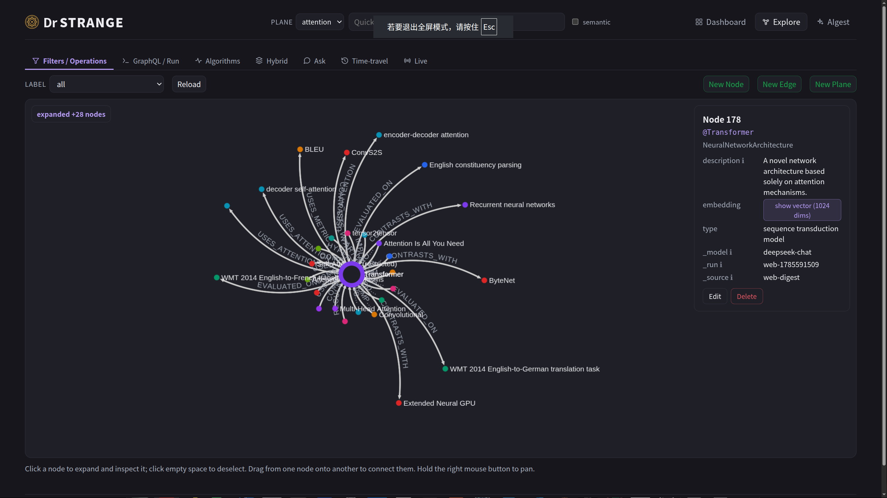
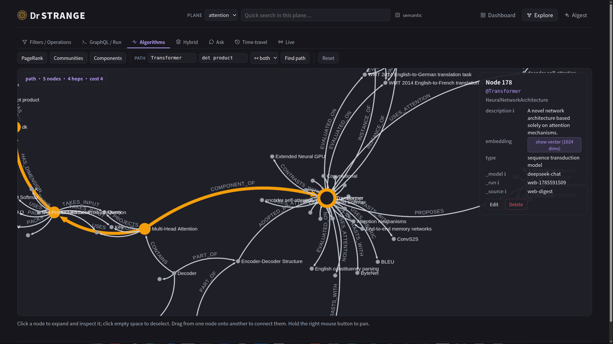
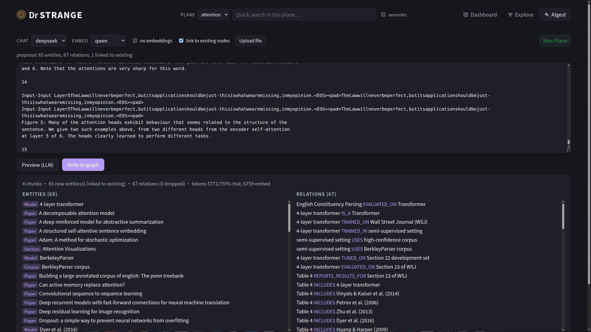
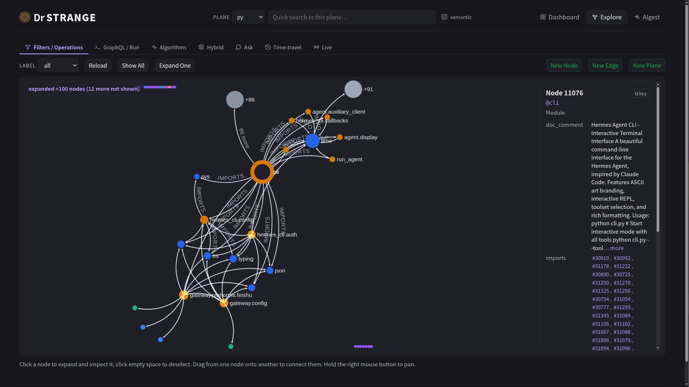
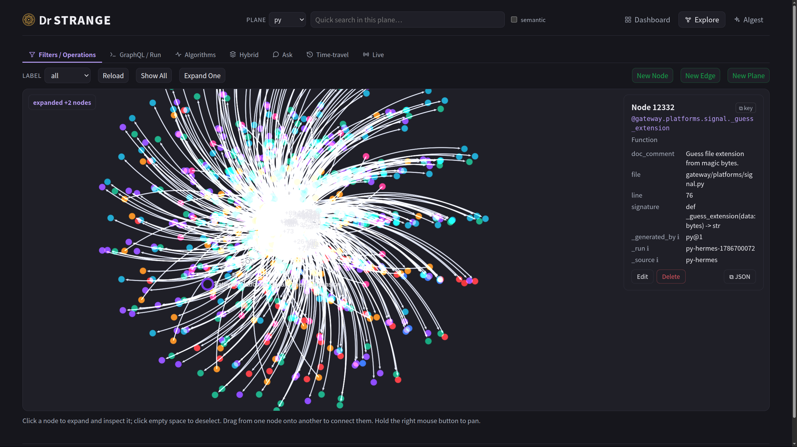

<p align="center">
  
</p>

<h1 align="center">Dr Strange</h1>

<p align="center"><em>一个 AI 原生的嵌入式图数据库，使用 Rust 编写。</em></p>

<p align="center">
  <a href="https://github.com/wangyingsm/dr-strange/actions/workflows/ci.yml"></a>
  <a href="https://github.com/wangyingsm/dr-strange/actions/workflows/release.yml"></a>
  <a href="https://github.com/wangyingsm/dr-strange/actions/workflows/docs.yml"></a>
  <a href="https://github.com/wangyingsm/dr-strange/releases/latest"></a>
  <a href="LICENSE-MIT"></a>
</p>

<p align="center"><a href="README.md">English</a> · <strong>简体中文</strong></p>

📖 **Dr Strange 手册** —— 完整教程与指南：
[English](https://wangyingsm.github.io/dr-strange/en/book/introduction.html) ·
[中文](https://wangyingsm.github.io/dr-strange/zh/book/introduction.html)。

## 简介

Dr Strange 是一个从设计之初便面向 AI 工作负载的图数据库：向量嵌入（embedding）
是一等的值类型，相似度检索与图遍历并行工作，引擎直接向智能体（agent）暴露契合其
需求的原语——自然语言查询、实时变更流与时间旅行——而非在传统图数据库之上事后叠加
AI 功能。

与 SQLite 类似，它是**嵌入式**的：以库的形式链接进应用，由单个磁盘文件承载，无需
运维独立的服务进程。但与 SQLite 不同，它同样可以**对外服务**——`drsg serve` 提供
JSON-RPC 2.0 接口、浏览器控制台以及 WebSocket 变更流，并配有六种语言的客户端 SDK。

它同时也是一台代码智能引擎。沙箱化的 wasm 解析器插件将一个代码仓库图化为符号与
已解析关系——官方支持八种语言，全程无需模型参与——`drsg serve watch` 让这张图随
每一次提交保持同步，一组紧凑的智能体工具则以单次往返回答结构性问题（谁调用了它、
改动它会影响什么、X 如何到达 Y）。参见[面向编码智能体](#面向编码智能体)。

对于围绕知识图谱、GraphRAG 流水线或智能体长期记忆构建的应用，Dr Strange 力求成为
承载这一切的单一存储。

## Web UI 截图

<table>
  <tr>
    <td width="50%"><a href="screenshots/00.jpg"></a><br><sub><b>Dashboard</b> —— 实时统计、平面管理与已安装的解析器插件</sub></td>
    <td width="50%"><a href="screenshots/01.jpg"></a><br><sub><b>Explore</b> —— 交互式图谱与节点详情</sub></td>
  </tr>
  <tr>
    <td width="50%"><a href="screenshots/02.jpg"></a><br><sub><b>Algorithms</b> —— PageRank、社区发现与最短路径</sub></td>
    <td width="50%"><a href="screenshots/03.jpg"></a><br><sub><b>AIgest</b> —— LLM 文档摄取，抽取实体与关系</sub></td>
  </tr>
  <tr>
    <td width="50%"><a href="screenshots/04.jpg"></a><br><sub><b>代码图</b> —— 已图化平面上一个模块的导入邻域</sub></td>
    <td width="50%"><a href="screenshots/05.jpg"></a><br><sub><b>代码平面</b> —— 整张图一览；每条事实都带文件、行号、签名与解析它的插件</sub></td>
  </tr>
</table>

## 特性

| 能力 | 提供的价值 |
|---|---|
| **平面（Planes）** | 单个数据库中承载多个相互独立的图 |
| **一等向量嵌入** | 向量属性，原生以 HNSW 建立索引 |
| **混合检索** | 融合向量 + 关键词（BM25）+ 图邻近度的检索 |
| **查询语言** | 可序列化的逻辑计划，以及 openCypher 子集 |
| **图算法** | PageRank、连通分量、最短路径、Louvain |
| **自然语言查询** | 以自然语言提问 → 生成计划 → 执行 |
| **时间旅行** | 读取图在过去某次提交或某个时间戳**时刻**的状态 |
| **变更流** | 订阅某个平面并实时接收其变更 |
| **代码图化** | 沙箱化的 wasm 解析器插件将代码仓库转化为已解析的调用图——官方支持 8 种语言，并提供社区解析器 SDK |
| **提交同步监视** | `serve watch` 将每次提交折叠进平面，结果与全量重新消化收敛一致 |
| **智能体工具** | `context` · `search` · `describe` · `grep` · `trace` · `impact` · `snippet`——每个问题一次往返 |
| **备份 / 恢复** | 一致且保留 id 的全库快照 |
| **接口** | Web 控制台、六种语言 SDK、命令行工具，以及提供智能体工具的 MCP 服务器 |

依赖模型的功能（自然语言查询、文档摄取与文本嵌入检索）会调用外部或本地的 LLM；其余
功能均无需任何模型即可运行。参见[附录 C](https://wangyingsm.github.io/dr-strange/zh/book/appendix-c.html)。

## 安装

一行命令，无需任何工具链。安装脚本会下载对应平台的发行版二进制、校验其 SHA-256，
并将其放入 `PATH`。可安装的二进制有两个：命令行与服务端 `drsg`，以及面向 LLM
智能体的 MCP 服务 `drsg-mcp`。

**Linux**

```console
# 命令行与服务端 —— drsg
$ curl -fsSL https://raw.githubusercontent.com/wangyingsm/dr-strange/master/scripts/install.sh | sh

# MCP 服务 —— drsg-mcp
$ curl -fsSL https://raw.githubusercontent.com/wangyingsm/dr-strange/master/scripts/install.sh | sh -s -- --bin drsg-mcp
```

**macOS**（同一个脚本；Apple 芯片与 Intel 均可）

```console
# 命令行与服务端 —— drsg
$ curl -fsSL https://raw.githubusercontent.com/wangyingsm/dr-strange/master/scripts/install.sh | sh

# MCP 服务 —— drsg-mcp
$ curl -fsSL https://raw.githubusercontent.com/wangyingsm/dr-strange/master/scripts/install.sh | sh -s -- --bin drsg-mcp
```

**Windows**（PowerShell）

```console
# 命令行与服务端 —— drsg
PS> irm https://raw.githubusercontent.com/wangyingsm/dr-strange/master/scripts/install.ps1 | iex

# MCP 服务 —— drsg-mcp（以代码块方式运行：管道送入的脚本无法接收参数）
PS> & ([scriptblock]::Create((irm https://raw.githubusercontent.com/wangyingsm/dr-strange/master/scripts/install.ps1))) -Bin drsg-mcp
```

`--bin all` 同时安装两个二进制；`--version v1.1.0` 指定某个发行版本，`--dir <path>`
指定安装目录（默认 `~/.local/bin`，Windows 上为 `%LOCALAPPDATA%\Programs\drsg\bin`）。
在 Windows 上对应的参数为 `-Bin`、`-Version` 与 `-Dir`。

其他方式：容器镜像 `ghcr.io/wangyingsm/dr-strange:latest`，或
[发行页](https://github.com/wangyingsm/dr-strange/releases)上的归档包与校验和。

**从源码构建**——最后的选择，适用于没有发布二进制的平台，或需要构建工作副本的场景。
需要 [Rust 工具链](https://rustup.rs)；仪表盘在编译期嵌入二进制，因此请先构建单页应用
（`just web-build`，需要 [bun](https://bun.sh)），否则二进制中只会带有占位页。

```console
$ cargo build --release -p dr-strange-cli   # → target/release/drsg
$ cargo build --release -p dr-strange-mcp   # → target/release/drsg-mcp
```

## 快速上手

```console
# 创建一个平面，写入数据并查询。
$ drsg --db graph.drsg plane create social
$ drsg --db graph.drsg cypher --plane social \
    'CREATE (a:Person {name:"Ada"})-[:KNOWS]->(b:Person {name:"Alan"})'

# 启动控制台 + API 服务。
$ drsg --db graph.drsg serve
```

完整的操作流程——构建、磁盘布局、向量嵌入与相似度检索、服务端及其配置，以及容器
镜像——参见手册的**快速上手**章节：
[English](https://wangyingsm.github.io/dr-strange/en/book/getting-started.html) ·
[中文](https://wangyingsm.github.io/dr-strange/zh/book/getting-started.html)。

## 面向编码智能体

Dr Strange 对待代码库的方式，与对待其他知识并无二致：一张图。解析器插件——沙箱化
的 wasm 组件，每种语言一个——将源码文件转化为符号与已解析的关系（带调用位置的
CALLS、REFERENCES、IMPORTS、EXTENDS 等），全程无需模型参与。`serve watch` 随后
跟踪每次提交，智能体查询到的图即已提交的代码——且每个回答开头都会注明对应的提交
（`synced: commit <sha>`）。

```console
# 安装解析器插件：不带参数时打开官方目录的交互式选择器（0 = 全部）；
# 也可以直接给出任意 .wasm 路径或 URL。
$ drsg plugin install

# 将一个代码仓库图化为一个以其命名的平面
$ drsg --db codes.drsg digest ~/src/myrepo --apply --no-embed

# 启动 API + MCP 服务，并让平面随每次提交保持同步
$ drsg --db codes.drsg serve watch --dir ~/src/myrepo

# 一个符号的完整邻域，一次调用
$ drsg --db codes.drsg context 'WriteTxn::delete_node' --plane myrepo
```

`--no-embed` 跳过向量嵌入——解析无需任何模型。之后运行 `drsg vectorize` 即可让
平面支持语义检索。

七个动词回答智能体的问题，每个都在一次往返内完成，输出均为紧凑的每行一条事实的
文本。七个动词全部是 `drsg serve` 上的 MCP 工具；其中五个同时是 CLI 子命令
（`grep` 与 `snippet` 需要读取被监视的源码树，因此只随服务端提供）。

| 动词 | 它回答的问题 |
|---|---|
| `context` | 关于一个符号的一切——定义、带调用位置的调用者、被调用者、引用——首选动词 |
| `search` | “我不知道名字”：在平面的向量嵌入上做语义 top-k |
| `describe` | 一个符号的属性——只看节点的轻量视图 |
| `grep` | 在被监视的源码树上做字面文本检索，有界且带计数 |
| `trace` | 一个符号如何到达另一个：图中记录的最短调用路径 |
| `impact` | 影响范围：所有能到达该符号的东西，按距离分组 |
| `snippet` | 一个符号的源码文本 |

两条纪律贯穿整套工具。歧义的名字从不猜测：回答是一份候选清单，由调用方挑选。
调用清单是一个明示的下界：解析器无法解析的调用会连同原因保留为 `UnresolvedRef`
事实，并且回答会说明这一点——错误的边比缺失的边更糟。

**插件。** `drsg plugin install` 可以安装任何解析器插件——本地 `.wasm` 文件或
URL——安装时验证其为合法组件并固定其 SHA-256，之后每次加载都会复查。不带参数时
列出官方目录：八种语言——Rust、Go、TypeScript/JavaScript、Python、Java、C、
web（HTML/CSS）与 TOML——逐一固定到
[dr-strange-extension](https://github.com/wangyingsm/dr-strange-extension)
仓库的发布标签（[最新发布](https://github.com/wangyingsm/dr-strange-extension/releases)）。
同一仓库也承载插件 SDK：解析器契约是一份公开的 WIT 接口，社区据此构建的解析器
与官方插件以完全相同的方式安装、在完全相同的沙箱中运行。

**对比表现。** 在与 ripgrep 工作流以及两款开源代码图 MCP 工具的智能体任务基准
中，drsg 完成了每一种任务形态——调用者、影响面、调用链与复合审计——每项任务只需
2–4 次工具调用，边际 token 开销最低，且是唯一会在回答中明示自身边界的工具。
方法、任务清单与完整表格见 [AGENT-BENCHMARKS.md](AGENT-BENCHMARKS.md)（英文）。
设计笔记：[arch/07-llm.md](arch/07-llm.md)（图化、插件与监视）与
[arch/06-mcp.md](arch/06-mcp.md)（MCP 服务）。

## 文档

手册逐一深入讲解各个部分：
[AI 原生](https://wangyingsm.github.io/dr-strange/zh/book/ai-native.html) ·
[查询语言](https://wangyingsm.github.io/dr-strange/zh/book/query-language.html) ·
[Web 控制台](https://wangyingsm.github.io/dr-strange/zh/book/web-ui.html) ·
[SDK](https://wangyingsm.github.io/dr-strange/zh/book/sdk.html) ·
[嵌入式 CLI](https://wangyingsm.github.io/dr-strange/zh/book/embedded-cli.html) ·
[MCP](https://wangyingsm.github.io/dr-strange/zh/book/mcp.html) ·
[插件](https://wangyingsm.github.io/dr-strange/zh/book/plugins.html) ·
[编码智能体](https://wangyingsm.github.io/dr-strange/zh/book/coding-agent.html) ·
[JSON-RPC API 清单](https://wangyingsm.github.io/dr-strange/zh/book/appendix-a.html) ·
[查询语言文法](https://wangyingsm.github.io/dr-strange/zh/book/appendix-b.html)。

在本地构建（mdBook）：`just docs-serve zh`（中文）或 `just docs-serve`（英文）。

## 架构

Dr Strange 由清晰分层构成——存储（手写的、支持 MVCC 的 LSM 引擎）、带版本戳的
缓存、计算、API 层，以及横贯各层的平面模型——外围的封装层（Web、SDK、CLI、MCP、
LLM）则位于内核之上。

- **[架构章节](https://wangyingsm.github.io/dr-strange/zh/book/architecture.html)** —— 分层全景图，以及提交序列
  （commit sequence）如何统一 MVCC、缓存、时间旅行与变更流。
- **[`arch/`](arch/)** —— 各层详细的设计笔记：
  [总览](arch/00-overview.md)、
  [存储](arch/01-storage.md)、
  [缓存](arch/02-cache.md)、
  [计算](arch/03-computation.md)、
  [API](arch/04-api.md)、
  [工具](arch/05-tools.md)、
  [MCP](arch/06-mcp.md)、
  [LLM 与代码图化](arch/07-llm.md)、
  [Web 控制台](arch/08-web-ui.md)、
  [平面](arch/09-planes.md)。

## 基准测试

针对一款嵌入式图数据库（Kùzu）、通用的嵌入式基线（SQLite）以及业界标准的服务型
数据库（Neo4j）所做的跨引擎对比。每个引擎都加载**相同**的确定性数据集——10 万
节点、50 万条边、128 维向量——并在各自的最优路径上运行**相同**的查询集。

| 操作（中位延迟，↓ 越小越好） | dr-strange | Kùzu | SQLite | Neo4j |
|---|---|---|---|---|
| 按键点查 | **3.3 µs** | 256.0 µs | 3.4 µs | 286.6 µs |
| 一跳扩展 | **6.2 µs** | 1.64 ms | 8.2 µs | 328.0 µs |
| 两跳可达集 | **26.8 µs** | 6.72 ms | 64.8 µs | 842.9 µs |
| 向量 top-k 查询 | **290.0 µs** | 7.43 ms | — | 2.43 ms |

嵌入式 KV 设计将所有图查询保持在个位数到数十微秒——点查与 SQLite 基本持平，扩展
与多跳遍历为全场最快——而向量检索是其拉开差距之处：top-k 延迟约为 Neo4j 的 1/8、
Kùzu 的 1/26，索引构建速度也数倍于两者（完整表格见 BENCHMARKS.md）。批量加载仍
落后于成熟的列式引擎。每项数据均为三次测量的中位数，所有引擎固定在同一组 CPU
核心上、单机测得——**仅供参考，并非排行榜**。方法学、注意事项、各操作的波动范围、
加载吞吐数据以及复现方式（`just bench-compare`，或仅测 dr-strange 的
`just benchmark`）详见 **[BENCHMARKS.md](BENCHMARKS.md)**。

## 许可证

本项目采用以下任一许可证授权：

- Apache License 2.0（[LICENSE-APACHE](LICENSE-APACHE) 或
  <http://www.apache.org/licenses/LICENSE-2.0>）
- MIT 许可证（[LICENSE-MIT](LICENSE-MIT) 或
  <http://opensource.org/licenses/MIT>）

由你选择其一。

### 贡献

除非你另有明确声明，凡是你有意提交、以纳入本作品的贡献（依 Apache-2.0 许可证的
定义），均应按上述方式进行双重许可，不附带任何额外条款或条件。
